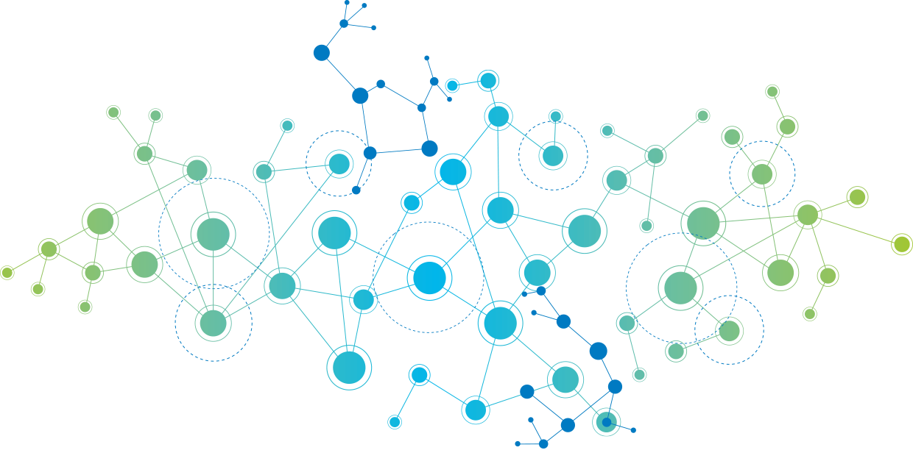
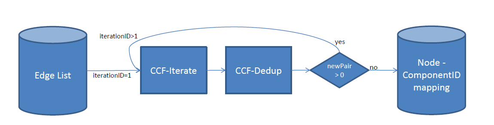
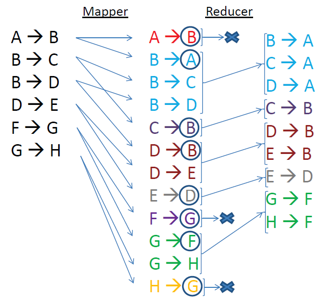

# Computation of Connected Component in Graphs with Spark  

Implementation of the "CCF: Fast and Scalable Connected Component Computation in MapReduce" paper with Spark. Study of its scalability on several datasets using various clusters' sizes on Databricks and Google Cloud Platform (GCP)

__TODO:__
- databricks run time
- time data loading & processing
- use graphx of spark
-  both RDD and DataFrames
- Python implementations must be provided
- comparing the RDD and DataFrame versions conducted on graphs of increasing size
- For small graphs use Databricks, for bigger ones use the cluster
- commande spark-submit

## Table of content
- [Abstract]()
- [Description of the CCF algorithm]()
- [Spark Implementation]()
- [Scalability Analysis]()
- [Conclusion]()
- [Appendix]()
- [References]()

--- 
# Abstract
A graph is a mathematical structure used to model pairwise relations between objects. It is made up of vertices (also called nodes or points) which are connected by edges (also called links or lines).  
Many practical problems can be represented by graphs: they can be used to model many types of relations and processes in physical, biological, social and information systems.
Finding connected components in a graph is a wellknown
problem in a wide variety of application areas. For that purpose; in 2014, H. Kardes, S. Agrawal, X. Wang and  A. Sun published ["CCF: Fast and scalable connected component computation in MapReduce"](). Hadoop MapReduce 
introduced a new paradigm: a programming model for processing big data sets in a parallel and in a distributed way on a cluster, it involves many read/write operations. On the contrary, by running as many operations as possible in-memory - few years later - Spark has proven to be much more faster and has become de-facto a new standard.   
In this study, we explain the algorithm and main concepts behind CCF. Then we make a PySpark inplementatoin. And finally we analyze the scalability of our solution applied on datasets of increasing sizes. The computations are realised on a cluster also of an increasing number of nodes in order to see the evolution of the calculation time. We've used the [Databricks community edition]() and [Google Cloud Dataproc]().

# Description of the CCF algorithm

## Connected component definition
First, let’s give a formal definition in graph theory context:
- V is the set of vertices 
- and E is the set of edges
- G = (V,E) be an undirected graph

__Properties__
- C = (C1,C2, ...,Cn) is the set of disjoint connected components in this graph  
- (C1 U C2 U ... U Cn) = V 
- (C1 intersect C2 intersect ... intersect Cn) = void. 
- For each connected component Ci in C, there exists a path in G between any two vertices vk and vl where (vk, vl) in Ci. 
- Additionally, for any distinct connected component (Ci,Cj) in C, there is no path between any pair vk and vl where vk in Ci, vl in Cj.  

Thus, problem of finding all connected components in a graph
is finding the C satisfying the above conditions.

## Global methodology

Here is how CCF works:
- it takes as input a list of all the edges. 
- it returns as an output the mapping (i.e a table) from each node to its corresponding componentID (i.e the smallest node id in each connected component it belongs to)

To this end, the following chain of operations take place:  

Two jobs run iteratively till we don't find any new connected peer attached to the existing components:

- __CCF-Iterate__  

This job generates an adjacency lists AL = (a1, a2, ..., an) for each node v i.e the list of new nodes belonging to the same connected component. Each time, the node id is eventually updated in case of a new peer node with an id that become the new minimum.  
If there is only one node in AL, it means we will generate the pair that we have in previous iteration. However, if there is more than one node in AL, it means that the process is not completed yet: an other iteration is needed to find other peers.

- __CCF-Dedup__   

During the CCF-Iterate job, the same pair might be emitted multiple times. The second job, CCF-Dedup, just deduplicates the output of the CCF-Iterate job in order to improve the algorithm's efficiency.

## Differents steps - counting new pairs
Let's break the whole process piece by piece using the example illustrated below:

- For each edge, the CCT-Iterate mapper emits both (k, v) and (v, k) pairs so that a should be in the adjacency list of b and vice versa. 
- In reduce phase, all the adjacent nodes are grouped together --> pairs are sorted by keys
- All the values are parsed group by group:
    - a first time to find the the minValue
    - a second time to emit a new componentID if needed
- The global NewPair counter is initialized to 0. For each component if a new peer node is found, the counter is incremented. At the end of the job, if the NewPair is still 0: it means that there is not any new edge that can be attached to the existing components: the whole computation task is over. Otherwise an other iteration is needed.

Then we just have to calculate the number of connected components by counting the distinct componentIDs.

# Spark Implementation

The mapper & reducer jobs illustrated above correspond to the first iteration of the following graph :

 todo !!!!!!!!

For the sake of clarity, we are going to replace A by 1, B by 2 and so on, and for each steps

designed algorithms plus related global comments/description 4 points; comments to main fragments of code 4 points

# Scalability Analysis

We use datasets and Hadoop clusters with Spark both of increasing sizes.  

## Datasets

[From the web site ....]()

| Name      | Type | Nodes     |  Edges   |   Description  | Collection  date | 
| :---        |    :----:   |          ---: | ---: | :--- | ---: | 
| web-Stanford |	Directed  |	281k  |	2,3M  |	Web graph of Stanford.edu      | 2002       | 
| web-NotreDame      | Directed |	325k  |	1,5M  | Web graph of Notre Dame       | 1999   | 
| web-BerkStan      | Directed       | 685k   | 7,6M	| Web graph of Berkeley and Stanford   | 2002   |  
| web-Google      | Directed |	875k	   | 5,1M   | Web graph from Google   | 2002   | 

__Datasets information__	

Nodes represent pages and directed edges represent hyperlinks between them for 
- Stanford University (stanford.edu) 
- University of Notre Dame (domain nd.edu)
- Berkely.edu and Stanford.edu domains
- Web pages released in  by Google as a part of Google Programming Contest.

# Conclusion
comments about the experimental analysis outlining weak and strong points of the algorithms. 3 points

# Appendix
including all the code code. 2 points
code + interactive graph

# References
Paper
- https://www.cse.unr.edu/~hkardes/pdfs/ccf.pdf

Datasets
- https://snap.stanford.edu/data/web-Stanford.html
- https://snap.stanford.edu/data/web-BerkStan.html
