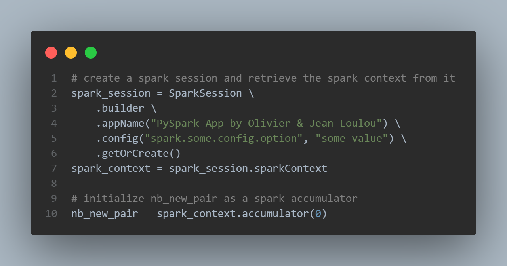

# Computation of Connected Component in Graphs with Spark  

Implementation of the "CCF: Fast and Scalable Connected Component Computation in MapReduce" paper with Spark. Study of its scalability on several datasets using various clusters' sizes on Databricks and Google Cloud Platform (GCP)

__TODO:__
- databricks run time
- time data loading & processing
- use graphx of spark
-  both RDD and DataFrames
- Python implementations must be provided
- comparing the RDD and DataFrame versions conducted on graphs of increasing size
- For small graphs use Databricks, for bigger ones use the cluster
- commande spark-submit

## Table of content
- [Abstract]()
- [Description of the CCF algorithm]()
- [Spark Implementation]()
- [Scalability Analysis]()
- [Conclusion]()
- [Appendix]()
- [References]()

--- 
# Abstract
A graph is a mathematical structure used to model pairwise relations between objects. It is made up of vertices (also called nodes or points) which are connected by edges (also called links or lines).  
Many practical problems can be represented by graphs: they can be used to model many types of relations and processes in physical, biological, social and information systems.
Finding connected components in a graph is a wellknown
problem in a wide variety of application areas. For that purpose; in 2014, H. Kardes, S. Agrawal, X. Wang and  A. Sun published ["CCF: Fast and scalable connected component computation in MapReduce"](). Hadoop MapReduce 
introduced a new paradigm: a programming model for processing big data sets in a parallel and in a distributed way on a cluster, it involves many read/write operations. On the contrary, by running as many operations as possible in-memory - few years later - Spark has proven to be much more faster and has become de-facto a new standard.   
In this study, we explain the algorithm and main concepts behind CCF. Then we make a PySpark inplementatoin. And finally we analyze the scalability of our solution applied on datasets of increasing sizes. The computations are realised on a cluster also of an increasing number of nodes in order to see the evolution of the calculation time. We've used the [Databricks community edition]() and [Google Cloud Dataproc]().  


# Description of the CCF algorithm

## Connected component definition
First, let’s give a formal definition in graph theory context:
- V is the set of vertices 
- and E is the set of edges
- G = (V,E) be an undirected graph

__Properties__
- C = (C1,C2, ...,Cn) is the set of disjoint connected components in this graph  
- (C1 U C2 U ... U Cn) = V 
- (C1 intersect C2 intersect ... intersect Cn) = void. 
- For each connected component Ci in C, there exists a path in G between any two vertices vk and vl where (vk, vl) in Ci. 
- Additionally, for any distinct connected component (Ci,Cj) in C, there is no path between any pair vk and vl where vk in Ci, vl in Cj.  

Thus, problem of finding all connected components in a graph
is finding the C satisfying the above conditions.

## Global methodology

Here is how CCF works:
- it takes as input a list of all the edges. 
- it returns as an output the mapping (i.e a table) from each node to its corresponding componentID (i.e the smallest node id in each connected component it belongs to)

To this end, the following chain of operations take place:  


Two jobs run iteratively till we don't find any new connected peer attached to the existing components:

- __CCF-Iterate__  

This job generates an adjacency lists AL = (a1, a2, ..., an) for each node v i.e the list of new nodes belonging to the same connected component. Each time, the node id is eventually updated in case of a new peer node with an id that become the new minimum.  
If there is only one node in AL, it means we will generate the pair that we have in previous iteration. However, if there is more than one node in AL, it means that the process is not completed yet: an other iteration is needed to find other peers.

- __CCF-Dedup__   

During the CCF-Iterate job, the same pair might be emitted multiple times. The second job, CCF-Dedup, just deduplicates the output of the CCF-Iterate job in order to improve the algorithm's efficiency.

## Differents steps - counting new pairs
Let's break the whole process piece by piece using the example illustrated below:  


- For each edge, the CCT-Iterate mapper emits both (k, v) and (v, k) pairs so that a should be in the adjacency list of b and vice versa. 
- In reduce phase, all the adjacent nodes are grouped together --> pairs are sorted by keys
- All the values are parsed group by group:
    - a first time to find the the minValue
    - a second time to emit a new componentID if needed
- The global NewPair counter is initialized to 0. For each component if a new peer node is found, the counter is incremented. At the end of the job, if the NewPair is still 0: it means that there is not any new edge that can be attached to the existing components: the whole computation task is over. Otherwise an other iteration is needed.

Then we just have to calculate the number of connected components by counting the distinct componentIDs.

# Spark Implementation

## Spark Session and context
First we create a Spark Session:




Spark applications run as independent sets of processes on a cluster, coordinated by the SparkContext object in your main program (called the driver program).

Spark Driver manage the whole application. It decides what part of job will be done on which Executor and also gets the information from Executors about task statuses.  


Since earlier versions of Spark or Pyspark, SparkContext (JavaSparkContext for Java) is an entry point to Spark programming with RDD and to connect to Spark Cluster, Since Spark 2.0 SparkSession has been introduced and became an entry point to start programming with DataFrame and Dataset.

An accumulator is used as an excrementing variable to count new pairs:
```
# initialize nb_new_pair as a spark accumulator
nb_new_pair = sc.accumulator(0)

[...]

def iterate_reduce_df(df):
    [...]
    nb_new_pair += df.withColumn("count", size("v")-1).select(sum("count")).collect()[0][0]
    [...]
...
```
Accumulators are created at driver program by calling Spark context object. Then accumulators objects are passed along with other serialized tasks code to distributed executors. Task code updates accumulator values. Then Spark sends accumulators back to driver program, merges their values obtained from multuple tasks, and here we can use accumulators for whatever purpose (e.g. reporting). Important moment is that accumulators become accessible to driver code once processing stage is complete.

We use the SparkSession to load the dataset into a DataFrame and the SparkContext to use it with RDD.


As you can see the first few lines of headers starting with '#' are not well interpreted, and so is the separator '\t':

```python
rdd_raw = load_rdd(path)
rdd_raw.take(6)
```

    ['# bla bla', '# header', '1\t2', '2\t3', '2\t4', '4\t5']


The same issue occurs for with a dataframe:

```python
df_raw = load_df(path)
df_raw.show(6)
```

    +---------+
    |      _c0|
    +---------+
    |# bla bla|
    | # header|
    |      1	2|
    |      2	3|
    |      2	4|
    |      4	5|
    +---------+
    only showing top 6 rows
    


## RDD & DataFrame

The RDDs are defined as the distributed collection of the data elements without any schema operating at low level. The Dataframes are defined as the distributed collection organized into named columns with a schema (but without being strongly typed like the Datasets).


Here is a more exhaustive lists of the differences:


They are considered "resilient" because the whole lineage of data transformations can be rebuild from the DAG if we loose an executor for instance.

Before computation of connected components we prepare the datasets by removing multiline headers and split the two columns separated by a tabulation:

  

We also cast the informations to integers to get a clean list of (keys, values) in the RDD:

```python
rdd = preprocess_rdd(rdd_raw)
rdd.take(10)
```

    [(1, 2), (2, 3), (2, 4), (4, 5), (6, 7), (7, 8)]

and a ready-to-use table in a Dataframe:

```python
df = preprocess_df(df_raw)
df.show(10)
```

    +---+---+
    |  k|  v|
    +---+---+
    |  1|  2|
    |  2|  3|
    |  2|  4|
    |  4|  5|
    |  6|  7|
    |  7|  8|
    +---+---+
    


## Explanation of each steps
The mapper & reducer jobs illustrated in the picture seen [previously (see "Differents steps - counting new pairs")]() correspond to the first iteration of the following graph :

grahpppppppppppppp

For the sake of clarity, we are going to replace the edges A by 1, B by 2 and so on... And for each steps, let's see both the RDD and DataFrame outputs.
The computation part starts with the "iterate map" function, its goal is to generate an exhaustive list of edges: 


The way to proceed is the same for RDDs or Dataframe: .union is used to concatenate the original RDD or DF with the inverted one.
The reversal is achieved by map keys / values in a different order for RDDs : `rdd.map(lambda x : (x[1], x[0]))` et by selecting the columns in a different order for DFs : `df.select(col("v").alias("k"), col("k").alias("v"))` alias allows us to rename properly columns' names:

```python
rdd = iterate_map_rdd(rdd)
rdd.take(20)
```

    [(1, 2),
     (2, 3),
     (2, 4),
     (4, 5),
     (6, 7),
     (7, 8),
     (2, 1),
     (3, 2),
     (4, 2),
     (5, 4),
     (7, 6),
     (8, 7)]

The output is quite similar with a Dataframe but with named columns: 

```python
df = iterate_map_df(df)
df.show(20)
```

    +---+---+
    |  k|  v|
    +---+---+
    |  1|  2|
    |  2|  3|
    |  2|  4|
    |  4|  5|
    |  6|  7|
    |  7|  8|
    |  2|  1|
    |  3|  2|
    |  4|  2|
    |  5|  4|
    |  7|  6|
    |  8|  7|
    +---+---+
    


```python
rdd = iterate_reduce_rdd(rdd)
rdd.take(16)
```


    [(2, 1),
     (3, 1),
     (3, 2),
     (4, 2),
     (4, 1),
     (5, 2),
     (5, 4),
     (7, 6),
     (8, 7),
     (8, 6)]


```python
df = iterate_reduce_df(df)
df.show()
```

    +---+---+
    |  k|  v|
    +---+---+
    |  2|  3|
    |  4|  5|
    |  2|  4|
    |  2|  5|
    |  6|  7|
    |  6|  8|
    |  7|  8|
    |  1|  2|
    |  1|  3|
    |  1|  4|
    +---+---+
    
The `compute_cc_rdd` and `compute_cc_df` are exactly the same.
- the number of iteration is initialized to zero
- a while loop takes place: if the number of pair at the beginning of the iteration remains unchanged at the end, we break in order to stop the loop. This is done with the condition `if start_pair == nb_new_pair.value:`. More precisely, the accumulator `nb_new_pair`is used as an incremental variable. If we want to compute the real number of new pairs, we have to set the values back to zero at the beginning of each iteration and check if the value is not nul at the end.
- as explained in the CCF algorithm paper, the jobs in the loop are:
    - iterate_map
    - iterate_reduce
    - and iterate_dedup (the deduplication is simply achieved using `rdd.distinct()` or `df.distinct()`)


Finally, the `workflow_rdd()` and `workflow_df()` functions are just wrappers containing all the previously seen functions:
- the dataset loading with `load_rdd(path)` and `load_df(path)`
- its preprocessing with `preprocess_rdd(df_raw)` and `preprocess_df(df_raw)`
- then the timer is started: `start_time = time.time()`
- after that, the computation of the connected components is launched `df = compute_cc_df(df)` / `rdd = compute_cc_rdd(df)`
- we print the number of connected components in the graph equal to `df.select('k').distinct().count()` (same code for RDDs
- and finally, we dispaly the duration in seconds which is equal to the delta: `time.time() - start_time`


__Side note__:  

Here we don't include in the timer the reading of the dataset. This time of reading can be decreased with more nodes in the clusters because of the redundancy of the data / distributed storage according to the Hadoop / HDFS replication factor (by default 3). But this is actually not what we're interested in. On the contrary, the computed number of distinct components should be counted in the duration, because it is our final objective.


# Scalability Analysis

We use datasets and Hadoop clusters with Spark both of increasing sizes.  

## Datasets

Source: [Stanford Large Network Dataset Collection web site](https://snap.stanford.edu/data/)

| Name      | Type | Nodes     |  Edges   |   Description  | Collection  date | 
| :---        |    :----:   |          ---: | ---: | :--- | ---: | 
| web-Stanford |	Directed  |	281k  |	2,3M  |	Web graph of Stanford.edu      | 2002       | 
| web-NotreDame      | Directed |	325k  |	1,5M  | Web graph of Notre Dame       | 1999   | 
| web-BerkStan      | Directed       | 685k   | 7,6M	| Web graph of Berkeley and Stanford   | 2002   |  
| web-Google      | Directed |	875k	   | 5,1M   | Web graph from Google   | 2002   | 


__Datasets information__	

Nodes represent pages and directed edges represent hyperlinks between them for 
- Stanford University (stanford.edu) 
- University of Notre Dame (domain nd.edu)
- Berkely.edu and Stanford.edu domains
- Web pages released in  by Google as a part of Google Programming Contest.

A for loop in the main function parse all the datasets one by one, and for each dataset the CC are computed using RDDs then Dataframes:


## Computation with Databricks

link online & appendix;;;;;;;;;;;;;;;;;;

## Computation using Google Cloud Dataproc

how to::::::::::::::
commande:::::::::::::
notebooks::::::::::::

3 way to launch oour job
- spark submit;;;;;;;;;;;;;;;;;;;;
- web ui
- notebook...........

# Conclusion
comments about the experimental analysis outlining weak and strong points of the algorithms. 3 points

# Appendix
including all the code. 2 points
code + interactive graph

# References
Paper
- https://www.cse.unr.edu/~hkardes/pdfs/ccf.pdf

Datasets
- https://snap.stanford.edu/data/web-Stanford.html
- https://snap.stanford.edu/data/web-BerkStan.html
